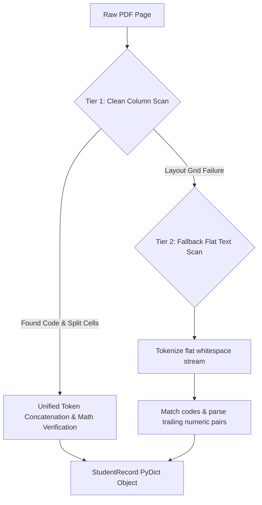

# ⚡ acatrack-pdf-parser-rs

A high-performance, native Rust PDF parsing engine designed specifically to extract structured academic student records and provisional exam marks. Bridged seamlessly to Python via **PyO3** and **Maturin**, it leverages multi-threaded CPU parallel processing via **Rayon** to slash batch ingestion processing times.

Developed as the core ingestion engine of **[AcaTrack](https://github.com/chetanuchiha16/acatrack)**, this parser solves complex visual layout alignment issues mathematically and runs **38.4x faster** than traditional sequential Python parsers.

---

## 🚀 Key Features

* **🏎️ Rayon Parallelization**: GIL-free multi-threaded PDF table extraction using CPU core saturation.
* **🛡️ Spacing-Robust Digit Concatenation**: Reconstructs fragmented, narrow visual columns (e.g., visual layout splits like `"4"` and `"5"` for a score of `45`) automatically.
* **📐 Virtual Row Splitting**: Automatically splits stacked cell values separated by newlines (`\n`) into neat, index-aligned rows.
* **📐 Mathematical Verification**: Automatically executes algebraic checksum checks ($\text{IA} + \text{SEE} == \text{Total}$) to guarantee $100\%$ parsing accuracy.
* **⚡ PyO3 FFI Bridge**: Compiled into a native `.so` / `.pyd` module that can be imported directly in Python with zero performance loss.
* **📊 FFI Telemetry**: Streams granular Rust execution logs back into Python for instant diagnostic debugging.

---

## 📊 Performance Benchmarks (1,308 PDFs)

Tested over **1,308 PDFs** (across 4 ZIP upload requests) containing freshman provisional university results:

| Metric | Sequential Python Core | **Parallel Rust Engine (This Library)** 🚀 | **Net Improvement** |
| :--- | :--- | :--- | :--- |
| **Total Parsing Duration** | `21.78` minutes | **`34.06` seconds (~0.57 min)** | **`38.4x` Faster** 🚀 |
| **Speed per PDF** | `0.9992` seconds | **`0.0260` seconds** | **`38.4x` Faster** 🚀 |
| **Memory Net Impact** | `+268.48` MB | **`+76.43` MB** | **`71.5%` Lower RAM** 📉 |

---

## 🛠️ Architecture

The parser integrates a dual-tier parsing fallback mechanism to remain robust across layout changes:



---

## 📦 Getting Started

### Prerequisites
* **Rust Toolchain**: `rustup`, `rustc`, `cargo` (Latest stable edition)
* **Python**: `3.8+`
* **Maturin**: `pip install maturin`

### Local Development & Setup

1. **Clone the repository**:
   ```bash
   git clone https://github.com/chetanuchiha16/acatrack-pdf-parser-rs.git
   cd acatrack-pdf-parser-rs
   ```

2. **Compile and install locally into your active Python environment**:
   ```bash
   # Builds in release mode and sets up an editable package link
   maturin develop --release
   ```

3. **Verify compilation**:
   ```bash
   python -c "import acatrack_rust; print(acatrack_rust.__doc__)"
   ```

---

## 🐍 Python Usage Example

```python
import acatrack_rust

# Target subjects to scan for
target_subjects = ["BMATS101", "BCHES102", "BCEDK103", "BENGK106"]

# Parse a single PDF file
record = acatrack_rust.parse_single_pdf(
    pdf_path="path/to/student_result.pdf",
    subject_codes=target_subjects
)

if record:
    print(f"USN: {record['usn']}")
    print(f"Name: {record['name']}")
    print(f"Marks Extracted: {record['marks']}")
    print("\n--- Telemetry Logs ---")
    for log in record['logs']:
        print(log)
```

---

---

## 📄 License
Licensed under the [MIT License](LICENSE).
